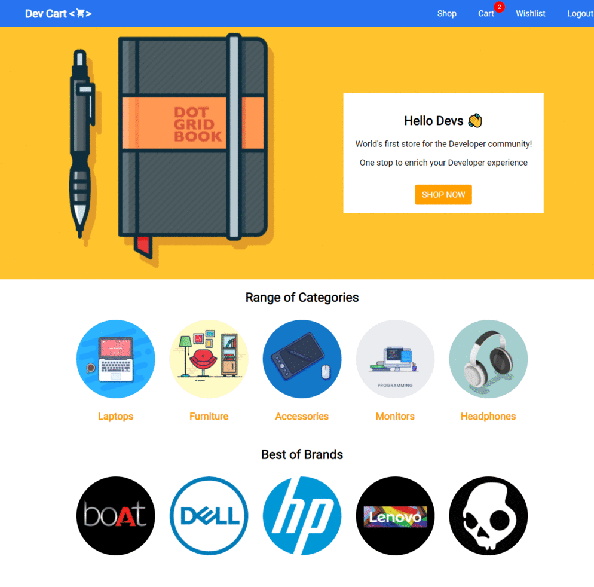

# Dev Cart

First ever ecommerce store for the developer community.

- One place for all developer needs, so that you can save time to refactor your code.
- Simplistic UI with least learning curve taking users to checkout with minimal distractions.
- Feature packed product listing page with capability to filter out brands, category and by rating.
- It comes with a powerful cart to review and manage all your items.
- Wishlist to save things for the future.
- Single page checkout that let's you place orders quickly. Overall, a feature packed webstore that can be setup in no time.

### Features

- Landing page
- Product listing page with filtering capability
- Cart with review and item management
- Checkout with Address Management and Payment forms for quick order placement
- User authentication

### Tech Stack

- React
- Express
- Mongo DB

### Installation & Usage

Clone down this repository. You will need `node` and `npm` installed globally on your machine.

`npm install`

To Run Test Suite:

`npm test`

To Start Server:

`npm start`

To Visit App:

`localhost:3000`

### Reflection

This was one of the first end-to-end projects that I built to concrete my understanding on the core concepts of React. Built using React hooks, I utilized to combinations of context API and reducer to simulate the capability of Redux for state management.

Building this project gave me a good understanding on designing component tree to facilitate better data flow. Features like filtering, cart management provided me on insights to structure the core states.

I have utilized libraries like React Router v6, axios, react toastify in this project.

### Upcoming Features

- Dedicated Product Page
- Mock Payment Integration
- Flexible or generic filtering module
